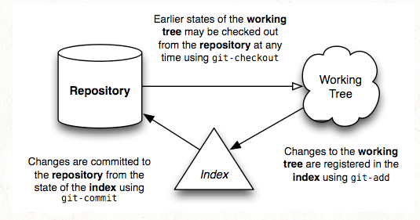

# Git Notes
This document is a collection of notes about Git, its inner working and components. 
Some of the information is liberally adapted from the following sources:

- [Git from the bottom up](https://jwiegley.github.io/git-from-the-bottom-up/)
- asdasd

## Overview
Git is an open source Version Control System (VCS) tool created by **Mr. Linus Torvalds**. It stores and processes file content much differently than other version control tools. 
After creating a repository, you do your work in the working tree. Once your work reaches a significant point, you add your changes successively to the index. Once the index contains everything you intend to commit, you record its content in the repository. Here’s a simple diagram that shows a typical project’s life-cycle:

## Repository
A Git repository is similar to a Unix file system. A file system starts with a root directory which contains other directories. The latter contain files (leaf nodes) that contain data. 
The metadata about the files' content is stored both in the **directory** (the file names) and the **i-nodes** that reference the contents of those files (their size, type, permissions, etc). 
Each i-node has a unique number that identifies the contents of its related file.
 You may have many directory entries pointing to a particular i-node (i.e., hard-links), it’s the i-node which “owns” the contents stored on your filesystem. 

Internally, Git has a very similar structure, with a couple of key differences. 

- It represents file’s contents in **blobs**, which are also leaf nodes in something very close to a directory, called a **tree**. 
- Just as an i-node is uniquely identified by a system-assigned number, a blob is named by computing the SHA1 hash id of its size and contents. Compared to the i-node, it has two additional properties: 
	- It verifies that the blob’s contents will never change.
	- The same contents shall always be represented by the same blob, no matter where it appears: across commits, across repositories, even across the whole Internet. It is an universal ID (GUID).   

	If multiple trees reference the same blob, this is just like hard-linking: the blob will not disappear from your repository as long as there is at least one link remaining to it.
	
The difference between a Git blob and a filesystem’s file is that a blob does not store metadata about its content. The information is kept in the tree that holds the blob. 

Notice, in this discussion, we are referring to the same repository containig the blob. The repository is located on the Internet, for instance. A blob identified by its specific ID is immutable in this repository. Obviousely, if you change the blob content you are going to have a different ID which refers to a different blob.  

In conclusion, a file (blob) in Git repository does not change. If you change the file in the working directory, the repositiory stores it as a different (immutable) file with its unique ID. The fact that blobs are immutable in the Git repository is what makes the all thing works. And as it turns out, this design allows for much more compact storage, since all objects having identical content can be shared, no matter where they are.

## The Blob
Let's create a sample Git repository, and show how Git works from the bottom up in the repository. 
Open your terminal window, create a directory and switch to it: 

	mkdir sample
	cd sample
	echo 'Hello, world!' > greeting
	
Let's find the hash id (SHA1) of the file as follows:

	git hash-object greeting
	af5626b4a114abcb82d63db7c8082c3c4756e51b 

Remember the hash ID is globally unique and associated with the file. Assuming that the file content does not change the ID refers to the same file, no matter from where you access it. It is the file <b>fingerprint</b>. 

Obviusely, if you change the file content, the ID is different, because the file is different. See the following:

	echo 'Hello, WORLD!' > greeting 
	git hash-object greeting
	6d28059f1d98e315184d0bebd028a45f3ef0ae10

If you run the previous command on another machine, you’ll get the same hash id. Even though you’re recreating two different repositories (possibly a world apart, even) the greeting blob in those two repositories will have the same hash id. You could even pull commits from from one repository into another, and Git would realize that you’re tracking the same content — and so would only store one copy of it! Pretty cool. 

The next step is to initialize a new repository and commit the file into it. We are going to do this all in one step right now, but then we'll come back and do it again in stages so you can see what’s going. 

	$ git init
	Initialized empty Git repository ../sample/.git/
	$ git add greeting
	$ git commit -m "Added my greeting"
	[master (root-commit) 031ce70] Added my 
	greeting 1 file changed, 1 insertion(+)
	create mode 100644 greeting
 
At this point the blob (file) is in the system exactly as we expected, using the hash id determined above. As a convenience, Git requires only as many digits of the hash id as are necessary to uniquely identify it within the repository. Usually just six or seven digits is enough:

	$ git cat-file -t af5626b
	blob
	$ git cat-file blob af5626b
	Hello, world!

As you can see the blob is in the repository and it contains the content we expected. 

It will always have this same identifier, no matter how long the repository lives or where the file within it is stored. These particular contents are now verifiably preserved, forever.

A <b>Git blob represents the fundamental data unit in Git</b>. Really, the whole Git system is about blob management.

## Trees
The contents of files are stored in blobs, which are featureless. They have no name, no structure. They are “blobs”, after all.

In order to represent the structure and naming of files, Git attaches these blobs to a tree as leaf nodes. Let's see where the blob we created lives. Here we go.
	
	git ls-tree HEAD
	100644 blob
	af5626b4a114abcb82d63db7c8082c3c4756e51b
	greeting	

The first commit added the greeting file to the repository. The commit contains one tree, which has a single leaf that is the greeting content blob.  

Although we can look at the tree containing the blob by passing HEAD to ls-tree, we haven’t yet seen the underlying tree object referenced by that commit. Here are a few other commands to discover the tree.

- Decode the HEAD alias of the commit it references. 

		git rev-parse HEAD
		031ce70da5e6b7c2daf637f020fa587b618e8755
- Verify the type of HEAD alias.

		git cat-file -t HEAD
		commit
- Get the hash ID of the tree held by the commit, as well as other info stored in the commit object. 
		
		git cat-file commit HEAD
		tree 0563f77d884e4f79ce95117e2d686d7d6e282887
		author Michael <milexm@gmail.com> 1554924964 -0700
		committer Michael <milexm@gmail.com> 1554924964 -0700

Notice tha the hash ID of the commit is unique to my repository because it includes my name and the date of the commit. 
But the hash ID of the tree is always the same. Let's verify it:

	git ls-tree 0563f77
	100644 blob
	af5626b4a114abcb82d63db7c8082c3c4756e51b	greeting 

As you can see the repository contains a single commit, which references a tree that holds a blob containing the recorded content. 

Let's verify this in another way. Let's check the objects contained by the repository:

	find .git/objects -type f | sort
	.git/objects/03/1ce70da5e6b7c2daf637f020fa587b618e8755
	.git/objects/05/63f77d884e4f79ce95117e2d686d7d6e282887
	.git/objects/af/5626b4a114abcb82d63db7c8082c3c4756e51b

The repository contains 3 objects whose hash ID we have encountered before. Let's look at the types of these objects once more:

	git cat-file -t 031ce70da5e6b7c2daf637f020fa587b618e8755
	commit
	git cat-file -t 0563f77d884e4f79ce95117e2d686d7d6e282887
	tree
	git cat-file -t af5626b4a114abcb82d63db7c8082c3c4756e51b
	blob

### Tree Structure

 
## Glossary

- **Repository** 
It is a collection of commits, each of which is an archive of what the project’s working tree looked like at a past date, whether on your machine or someone else’s.
 
It also defines **HEAD** which identifies the branch or commit the current working tree stemmed from. Lastly, it contains a set of branches and tags, to identify certain commits by name.

- **Commit** 
A commit is a snapshot of your working tree at some point in time.
 
The state of HEAD at the time your commit is made becomes that commit’s parent. This is what creates the notion of a **revision history**.

- **Index** 
Git does not commit changes directly from the working tree into the repository. Instead, it registers them in the **index**.
 It is a way of “confirming” your changes, one by one, before doing a commit, which records all your approved changes at once. Some call it the **staging area**, instead. 
- **Working tree** 
A working tree is any directory on your filesystem which has a repository associated with it, typically indicated by the presence of a sub-directory within it named **.git.**.
 It includes all the files and sub-directories in that directory.
- **Branch** 
A branch is just a name for a commit. It is also called a reference.
 It is the parentage of a commit which defines its history, and thus the typical notion of a “branch of development”.
- **Tag** 
A tag is also a name for a commit, similar to a branch, but it always refers to the same commit.
 It can have its own description text.
- **Master** 
The mainline of development in most repositories is done on a branch called “**master**”.
 
Although this is a typical default, there is nothing special about this branch.
 
- **HEAD** It is used by the repository to define what is currently checked out, specifically:
	- If you checkout a branch, HEAD symbolically refers to that branch, indicating that the branch name should be updated after the next commit operation.
	- If you checkout a specific commit, HEAD refers to that commit only. This is referred to as a detached HEAD, and occurs, for example, if you check out a tag name.

## References
- [Git from the bottom up](https://jwiegley.github.io/git-from-the-bottom-up/)

Yellow

Red

  

Green

Blu
