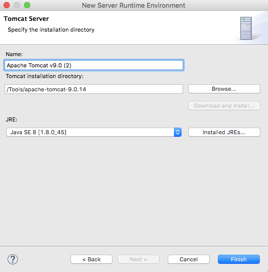
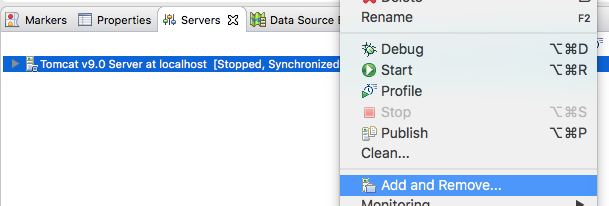
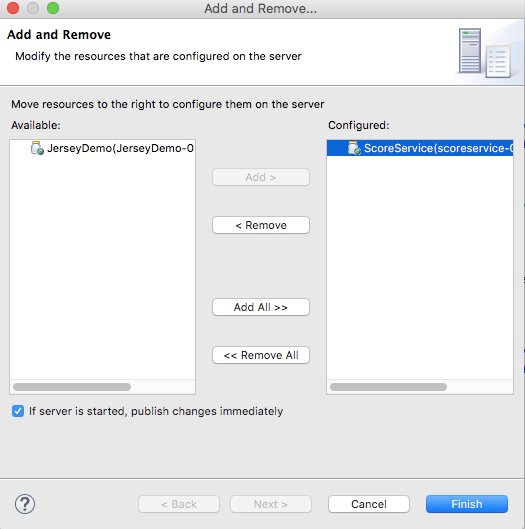
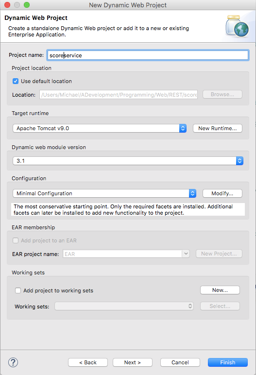
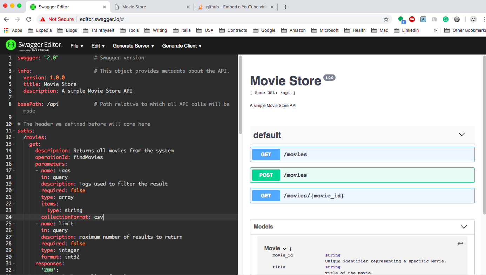
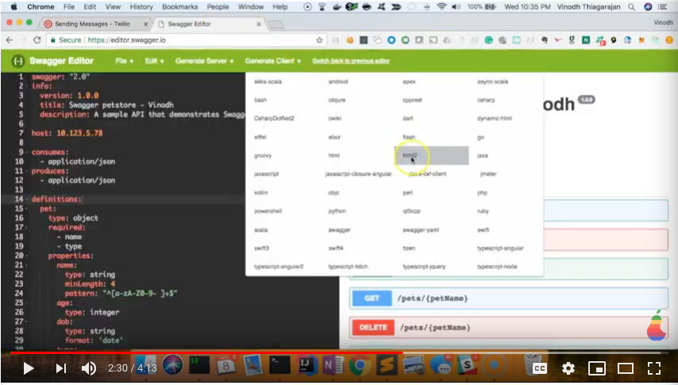

# RESTful Web Services
These notes are based on the tutorial [Step-by-step RESTful web service example in Java using Eclipse](https://www.theserverside.com/video/Step-by-step-RESTful-web-service-example-in-Java-using-Eclipse). They demonstrate how to create a JAX-RS RESTful web service using standard Java EE APIs. This step-by-step example in Java using Eclipse will get you up to speed on modern web service development techniques in less than 15 minutes. Let's go for it.

## Prerequisites

### Apache Tomcat
You need to install the Apache Tomcat server which is the target runtime for the next RESTful web service example in Java when using Eclipse and shown next.
 

📝 Apache Tomcat, often referred to as Tomcat Server, is an open-source Java Servlet Container developed by the Apache Software Foundation (ASF). Tomcat implements several Java EE specifications including Java Servlet, JavaServer Pages (JSP), Java EL, and WebSocket, and provides a "pure Java" HTTP web server environment in which Java code can run.

If you do not have Tomcat on your machine, you will first need to download and unzip [Apache Tomcat](http://tomcat.apache.org/download-90.cgi) (this scenario was written using Apache Tomcat version 9, but other versions can be substituted).

1. Start the Eclipse workbench.
2. Open **Eclipse -> Preferences -> Server -> Runtime Environments**
3. Click on **Add...**. The *New Server Runtime Environment** dialog is displayed.
4. Select your runtime under Apache (Apache Tomcat v9.0 in this example).
5. Click **Next**. 
6. Enter the directory from where Tomcat must be installed  (the directory where you unzipped Tomcat).
7. Select the JRE version.
8. Click **OK**.

 

#### Using Tomcat Installaltion
You may need to change the Tomcat configuration to assure that you ae using your Tomcat installation. Follow these steps:

1. In Eclipse, click the **Servers** tab, in the right pane, under the editor. 
2. Stop Tomcat, if it is running.
3. Right click on the Tomcat version you want to reconfigure. Select **Add and Remove...**.
 
4. Select the services in the right pane and click the **Remove** button.  
 
6. Click **Finish**.
7. Click **OK**.
8. In the Server tabbed area, righ click and select **Start**.
9. Double clik the Tomcat version, this displays the configuration information. 
10. In the *Server Locations* section select **Use Tomcat installation**.
11. Save the configuration file. 
12. Refresh the project.
13. Deploy your service to Tomcat server. 

Fore more information, see [Tomcat starts but Home Page does NOT open on browser with URL http://localhost:8080](https://crunchify.com/tomcat-starts-but-home-page-does-not-open-on-browser-with-url-http-localhost8080/).

### Java API for RESTful Web Services (JAX-RS)
Java API for RESTful Web Services (JAX-RS) is a Java programming language API spec that provides support for creating web services according to the Representational State Transfer (REST) architectural pattern. In order to simplify development of RESTful Web services and their clients in Java, a standard and portable JAX-RS API has been designed. Jersey RESTful Web Services framework is open source, production quality, framework for developing RESTful Web Services in Java that provides support for JAX-RS APIs and serves as a JAX-RS (JSR 311 & JSR 339) Reference Implementation.

From version 1.1 on, JAX-RS is an official part of Java EE 6. A notable feature of being an official part of Java EE is that no configuration is necessary to start using JAX-RS. 

🚨For non-Java EE 6 environments a small entry in the web.xml deployment descriptor is required. 

 
#### Aprroach 1 - Download the Library

1. Download the Jersey library at this location [Jersey](https://jersey.github.io/). 
1. Unarchive the downloaded library and copy the requires JAR files in the folder *WebConten/WEB.INF/lib*. 

#### Approach 2 - Refer to the Library
You can do this in the **pom.xml** file if you create the service using a Maven project. In the next examples we'll use this second approach.

📝 You can obtain the latest Maven dependencies at this location: [MVNrepository](https://mvnrepository.com/), where you search for *jersey server* and *jersey servelet*.
 

## Create ScoreService
The service we are going to create is a score counter for an onine *rock-paper-scissor* game app.

### Create Dynamic Web Project
1. Activate Eclipse.
2. In the top menu bar, select **File->New->Other**.
3. In the Select a wizard dialog window, expand the *Web* node and select **Dynamci Web Project**. 
4. Click **Next**.
5. In the Project name box enter *scoreservice*. 
6. In the Target runtime box select *Apache Tomcat v9.0*.
7. In the Configuration box select *Minimal Configuration*.  
8. Click **Finish**. 

#### Convert to Maven Project 
The conversion to Maven project makes managing  library references much easier. 

1. In the *Project Explorer*. right click on the project name.
2. In the drop-down menu, select **Configure->Convert to Maven Project**. 
3. In the *Maven POM* pop up dialog, in the Group Id box, enter the group id, for example *com.acloudysky.scoreservice*.
4. Click **Finish**.
5. Add the dependencies shown next to the *pom.xml*. file: 

		<dependencies>

			<!-- https://mvnrepository.com/artifact/com.sun.jersey/jersey-servlet -->
			<dependency>
		    	<groupId>com.sun.jersey</groupId>
		    	<artifactId>jersey-servlet</artifactId>
		    	<version>1.19.4</version>
			</dependency>
	    	<!-- https://mvnrepository.com/artifact/com.sun.jersey/jersey-server -->
			<dependency>
	    		<groupId>com.sun.jersey</groupId>
	    		<artifactId>jersey-server</artifactId>
	    		<version>1.19.4</version>
			</dependency>
		</dependencies>

### Create the Score Class
To keep things simple, we won't add any setters or getters. Furthermore, we are going to make the properties of the Score class static. This will enable the Java virtual machine (JVM) to simulate persistence between stateless calls to the web service. 

🚨This approach will enable us to run and test the application on a single JVM. However, you should manage application state in this way only as a proof of concept. It's better to persist data with [Hibernate and Java Persistence API](https://www.theserverside.com/tip/How-JPA-and-Hibernate-simplify-data-persistence) or save information to a [NoSQL](https://searchdatamanagement.techtarget.com/definition/NoSQL-Not-Only-SQL) database.

1. Right click on the **src** folder, under the *Java Resources* folder.
2. In drop-down menus select **New->Package** and enter name of your choosing. In this example we chose *com.acloudysky.score*.
2. Click **Finish**.
3. Right-click the package name. In the drop-down menu select **New->Class**. 
4. In the Name box enter *Score*. 
5. Click **Finish**. 
6. In the class editor enter the following code:

		package com.acloudysky.score;
		
		public class Score {
			public static int WINS, LOSSES, TIES;
		}

### Create the ScoreService Class
The class **ScoreService** is the heart of this RESTful web service example in Java using Eclipse. As such, you must decorate the class with the following annotations:

- **ApplicationPath**. It identifies the application path that serves as the base URI for all resources. 
- **Path**. It identifies the URI path that a resource class or resource method serves the request for. 

Fore more information, see [JAX-RS - Creating Resources using @ApplicationPath, @Path, @PathParam](https://www.logicbig.com/tutorials/java-ee-tutorial/jax-rs/path-annotion-resource-mapping.html).  

#### Get
This class will contain three getter methods that enable RESTful web clients to query the number of wins, losses or ties. These methods each have 

	- JAX-RS **@GET** annotation 
	- **@Produces** annotation indicating they return a text string 
	- **@Path** annotation indicating the URL clients need to use in order to invoke the method. 

#### Post
The increase methods follow a similar pattern with the exception that they are invoked via a POST.

#### Last Two
The last 2 methods class enable users to get the JSON-based representation of the complete score or pass query parameters to the web service to update the static properties of the Score class. Both methods use the /score path, and both produce JSON. But the getScore method is invoked through an HTTP GET request, while the update method is invoked through a PUT.

		package com.acloudysky.score;
		import javax.ws.rs.*;

		@ApplicationPath("/")
		@Path("")
		public class ScoreService {
	@GET
	@Path("/score")
	@Produces("application/json")
	public String getScore() {
		String pattern = "{ \"wins\":\"%s\", \"losses\":\"%s\", \"ties\": \"%s\"}";
		return String.format(pattern,  Score.WINS, Score.LOSSES, Score.TIES );	
	}
	
	
	// localhost:8080/scoreservice/score?wins=2%losses=3@ties=15
	@PUT
	@Path("/score")
	@Produces("application/json")
	public String update(@QueryParam("wins") int wins, 
							  @QueryParam("losses")	int losses, 
							  @QueryParam("ties")	int ties) {
		Score.WINS   = wins;
		Score.TIES   = ties;
		Score.LOSSES = losses;
		String pattern = "{ \"wins\":\"%s\", \"losses\":\"%s\", \"ties\": \"%s\"}";
		return String.format(pattern,  Score.WINS, Score.LOSSES, Score.TIES );
	
	}
	
	
	@POST @Path("/score/wins")@Produces("text/plain")
	public int increaseWins() {	return Score.WINS++; }
	
	@POST @Path("/score/ties")@Produces("text/plain")	
	public int increaseTies() {	return Score.WINS++;}
	
	@POST @Path("/score/losses")@Produces("text/plain")		
	public int increaseLosses() {return Score.LOSSES++;}
	
	@GET @Path("/score/wins")@Produces("text/plain")
	public int getWins() {return Score.WINS;}
	
	@GET @Path("/score/losses")@Produces("text/plain")
	public int getLosses() {return Score.LOSSES;}
	
	@GET @Path("/score/ties")@Produces("text/plain")
	public int getTies() {return Score.TIES;}

	}

## Deploy and Test ScoreService
Now that you've created the ScoreService, it is time to test it. To do so, perform the following steps:

### Deploy the service to Tomcat 

1. In the *Project Explorer*. right click on the project name.
2. In the drop-down menu, select **Run As->Run on Server...**.
3. Select the Tomcat server version to run on.
4. Click **Finish**.
5. You should have the service runnin at this location: *http://localhost:8080/ScoreService/*.
6. In the browser window, enter **http://localhost:8080/ScoreService/scor**. You should  get the following:

		{ "wins":"0", "losses":"0", "ties": "1"}
		
8.  Now, let's test tha various methods. in your terminal window enter the following commands:

		curl -X GET  "http://localhost:8080/ScoreService/score/
		curl -X POST  "http://localhost:8080/ScoreService/score/ties"
		curl -X PUT  "http://localhost:8080/ScoreService/score/?wins=10&losses=5&ties=3"

This conclude the exercise. Hopefully, you found it useful and got the inspration to explore more about the fascinating REST world. 

📝 You can download the complete project at <a href="">ScoreService</a>

## Generate Documentation 
You can generate the REST API documentation with Swagger. Let's look at an example.

###  Movie Store API

You can find the exmape at [Creating a Simple Movie Store API with Swagger](https://www.codementor.io/ayushgupta/creating-a-simple-movie-store-api-with-swagger-tmecy3y8t). The Yaml file that goes along whit the example is found at [movies.yanl](movies.yaml). 

1. In your browser open the [Swagger Editor](http://editor.swagger.io/).
2. In the editor panael, copy the movies.yaml file. 
You will get the following:

3. In the menu bar, click **Generate Client**.
4. In the drop-down menu, click **html2** 
5. The archive *html2-client-generated.zip* is downloaded. 
6. Unarchive it. You will get the API documentation in HTML, as you can see at [movie_docs](movie_docs/index.html).
7. The docs also include code examples in different languages. 

### ScoreService API Documentation
Let's now generate the documentation for the ScoreService examaple, created eralier, using Swagger.

1. In your browser open the [Swagger Editor](http://editor.swagger.io/).
2. Let's create the API specification. You can find it at [score_service.yaml](score_service.yaml).
3. Let's generate the docs in HTNL. You can find them at [score_service_docs](score_service_docs/index.html).

### References

- 
- fsdfsd

##References
- [Step-by-step RESTful web service example in Java using Eclipse](https://www.theserverside.com/video/Step-by-step-RESTful-web-service-example-in-Java-using-Eclipse)
- [The ServerSide](https://www.theserverside.com/)
- [JAX-RS - Creating Resources using @ApplicationPath, @Path, @PathParam](https://www.logicbig.com/tutorials/java-ee-tutorial/jax-rs/path-annotion-resource-mapping.html)
- [Tomcat starts but Home Page does NOT open on browser with URL http://localhost:8080](https://crunchify.com/tomcat-starts-but-home-page-does-not-open-on-browser-with-url-http-localhost8080/)

